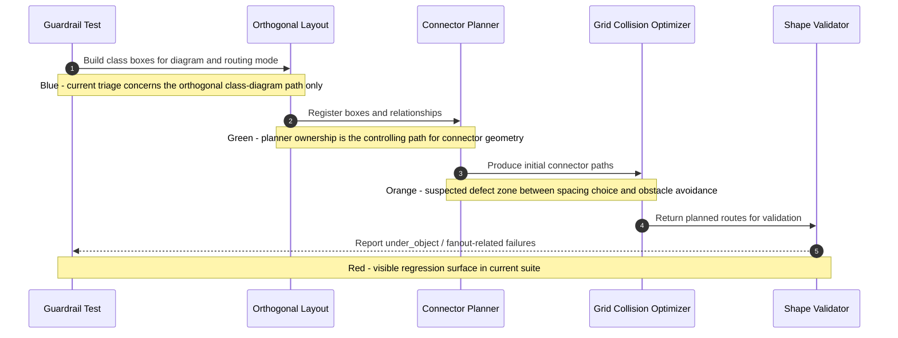

# Router Incident: 2026-05-27 Guardrail Triage For Fanout And Under-Object Failures

## Incident Metadata

- Date: 2026-05-27
- Author: GitHub Copilot
- Triggering request: Triage existing routing guardrail failures with priority on fanout breakage and connectors going through objects; inspect stash for desirable refactor work.
- Affected diagram(s): `DataModelRelationships`, `OrthogonalStressDense`, `LayeredArchitecture`, `UtilityDependencies`
- Affected routing mode(s): `orthogonal`
- Severity: high

## Problem Statement

The class-diagram routing guardrail suite is failing across multiple diagrams. The immediate priorities are fanout behavior that no longer satisfies expected geometry and connector segments that pass through unrelated object bodies.

## Trigger Evidence

- Input/test/diagram that exposed the issue: `Test/test_class_diagram_routing_guardrails.py`
- Expected behavior: fanout remains explicit and perpendicular to the source side, and connector segments do not pass through unrelated objects.
- Actual behavior: the suite reports under-object failures and related routing defects across five diagrams; the current failing examples include `OrthogonalStressDense` segments crossing `AuthService`, `UserService`, `MetricsCollector`, `AuditLog`, and `TraceContext`.
- Regression status: existing regression surface present before this documentation-only session

## Current Owning Code Path

- Suspected owning module(s): `Scripts/class_diagram_connectors.py`, `Scripts/class_diagram_renderer.py`
- Suspected owning function(s): `_layout_classes_orthogonal()`, `_optimize_layout_for_grid_collisions()`, connector edge-pair selection and orthogonal path construction inside `ConnectorPlanner`
- First control point worth checking: orthogonal layout spacing and obstacle-aware route selection before post-layout collision warnings

## Sequence Diagram Of Routing Logic

## Color-Coded Notes

### Green Notes
- The failure surface is reproducible with a single test command: `python Test\run_all_tests_and_view.py` or the focused guardrail test.
- The primary owning code path is local to class-diagram layout and connector planning, not sequence rendering.
- The guardrail test clearly classifies `under_object` failures with concrete segments and obstacle names.

### Orange Notes
- Current evidence suggests some `under_object` failures are layout-pressure problems rather than pure connector-marker defects.
- Fanout regressions may share the same root cause if layout compaction or edge-pair simplification is collapsing available first-segment lanes.
- The large stash refactor may contain useful architectural ownership rules, but it should be reintroduced selectively.

### Red Notes
- Full test gate is failing, so commit is blocked by repository rule.
- Guardrail failures include connector segments crossing unrelated objects in dense diagrams.
- The user-referenced refactor was not safely preserved in mainline behavior and now requires selective recovery.

### Blue Notes
- `stash@{0}` is a small requirements/test cleanup, not the large desired refactor.
- `stash@{2}` appears to contain the larger class-diagram layout architecture refactor and trace artifacts.
- Next probe: inspect the route-construction and obstacle-check logic around orthogonal planning to determine whether a small local spacing or edge-selection change can reduce `under_object` failures without reopening broader design changes.

## Investigation Questions

1. What exact input or diagram triggered the routing issue?
2. Which routing stages are confirmed to behave correctly?
3. Where does the failure first become visible?
4. Which branch or decision remains uncertain?
5. What narrow validation will run next?

## Falsifiable Hypothesis

At least the priority `b` failures occur because orthogonal layout spacing and/or edge-pair simplification allows the planner to choose routes that remain geometrically valid but ignore unrelated-object obstacles until after the route is effectively fixed.

## Next Validation Step

- Validation command or manual check: run the focused guardrail test and inspect one failing diagram after a small local planner/layout adjustment.
- What result would confirm the hypothesis: `under_object` failures drop for dense diagrams without breaking fanout tests.
- What result would disconfirm the hypothesis: failures persist unchanged, implying the dominant defect is inside route construction or obstacle scoring rather than layout spacing.

## Implementation Boundary

- Allowed next edit scope: local changes in class-diagram layout spacing or connector-planner obstacle handling for the failing slice.
- Explicitly out of scope for the next edit: broad revival of the full stashed refactor, unrelated renderer behavior, or test-fixture CSV changes.

## Outcome

- Status: triage captured
- Follow-up artifact(s):
    - prioritize `b` under-object failures first because they dominate the current guardrail surface (52 of 102 issues)
    - treat `a` fanout as a secondary check because dedicated fanout guardrails are currently passing
    - use `stash@{2}` as a design-recovery reference only; do not apply it wholesale
- Residual risks: fanout-specific regressions may require architectural rules from the stashed refactor if small local fixes are insufficient

## Triage Summary

### Priority A: Fanout Not Working
- Dedicated fanout probes are currently passing.
- No primary failing slice has yet shown a direct fanout-geometry regression.
- Keep this as a follow-up check after the under-object slice is reduced.

### Priority B: Connectors Going Through Objects
- This is the dominant failure class.
- Current count from the focused guardrail check: `under_object = 52`, `segment_overlap = 34`, `target_orientation = 10`, `near_object_border = 4`, `corner_like_endpoint = 2`.
- Repro diagrams to prioritize:
    - `OrthogonalStressDense`
    - `LayeredArchitecture` (both copies)
    - `DataModelRelationships`
    - `UtilityDependencies`

### Stash Recovery Summary
- `stash@{0}` is a small cleanup subset, not the desired refactor recovery point.
- `stash@{2}` is the useful design packet and contains:
    - `Process/CLASS_DIAGRAM_LAYOUT_ARCHITECTURE_REQUIREMENTS.md`
    - `Process/03_Design/DATAMODEL_ROUTING_TRACE.md`
    - routing sequence traces in `Process/01_System/10_Diagrams/` and `Process/02_Architecture/10_Diagrams/`
- The stash should be mined into incremental tasks, not restored wholesale.