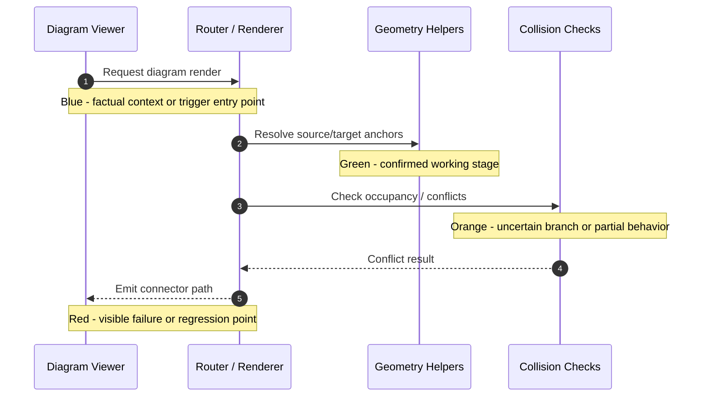

# Router Incident Template

Use this template when a complex Diagram Viewer routing problem requires a formal investigation artifact.

Related rule:
- `Process/ROUTER_INCIDENT_WORKFLOW.md`

---

# Router Incident: <short incident title>

## Incident Metadata

- Date: YYYY-MM-DD
- Author: <agent or human>
- Triggering request: <chat summary or task>
- Affected diagram(s): <diagram id or csv path>
- Affected routing mode(s): <orthogonal>
- Severity: <high | medium | low>

## Problem Statement

Describe the visible routing failure in one short paragraph.

## Trigger Evidence

- Input/test/diagram that exposed the issue:
- Expected behavior:
- Actual behavior:
- Regression status: <new bug | existing bug | regression>

## Current Owning Code Path

- Suspected owning module(s):
- Suspected owning function(s):
- First control point worth checking:

## Sequence Diagram Of Routing Logic

Replace this example with the current routing flow under investigation.

## Color-Coded Notes

### Green Notes
- Confirmed working behavior, invariant, or code path:

### Orange Notes
- Partially working behavior, uncertainty, or competing hypothesis:

### Red Notes
- Confirmed failure, regression, contradiction, or missing guardrail:

### Blue Notes
- Factual context, assumptions, open questions, or next probe:

## Investigation Questions

1. What exact input or diagram triggered the routing issue?
2. Which routing stages are confirmed to behave correctly?
3. Where does the failure first become visible?
4. Which branch or decision remains uncertain?
5. What narrow validation will run next?

## Falsifiable Hypothesis

State one local hypothesis that could be disproven by the next check.

## Next Validation Step

- Validation command or manual check:
- What result would confirm the hypothesis:
- What result would disconfirm the hypothesis:

## Implementation Boundary

- Allowed next edit scope:
- Explicitly out of scope for the next edit:

## Outcome

- Status: <analysis only | ready for edit | fixed and validated>
- Follow-up artifact(s):
- Residual risks: